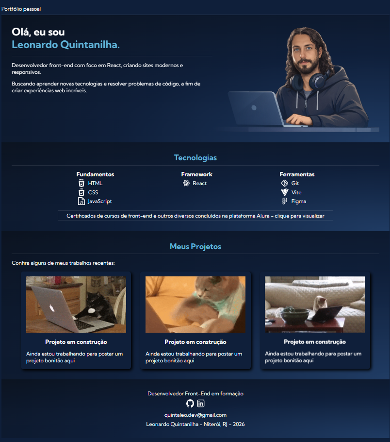

# 💼 Portfólio - Leonardo Quintanilha

Este é o meu portfólio pessoal desenvolvido com foco em apresentar meus projetos, habilidades e evolução como desenvolvedor front-end.

🔗 **Acesse o projeto online:**
👉 https://quintaleodev.vercel.app

---

## 🚀 Tecnologias utilizadas

* HTML5
* CSS3
* JavaScript
* React
* Vite
* Git

---

## 📌 Funcionalidades

* Apresentação pessoal
* Seção de projetos
* Listagem de tecnologias
* Links para contato (GitHub, LinkedIn e e-mail)
* Layout responsivo (mobile-first)

---

## 🧠 Aprendizados

Durante o desenvolvimento deste projeto, trabalhei e aprimorei:

* Estruturação de componentes no React
* Manipulação de dados com JSON
* Organização de código em projetos front-end
* Deploy utilizando Vercel
* Boas práticas de responsividade

---

## 🚧 Status

Projeto em desenvolvimento — novos projetos serão adicionados em breve.

---

## 📂 Como rodar o projeto localmente

```bash
# Clone o repositório
git clone https://github.com/quintaleodev/portfolio.git

# Acesse a pasta
cd portfolio

# Instale as dependências
npm install

# Rode o projeto
npm run dev
```

---

## 🌐 Deploy

O projeto está hospedado na Vercel:

👉 https://quintaleodev.vercel.app

---

## 📬 Contato

* GitHub: https://github.com/quintaleodev
* LinkedIn: https://www.linkedin.com/in/quintaleo-dev/
* Email: quintaleo.dev@gmail.com

---

## 📄 Licença

Este projeto é de uso pessoal para fim de estudos.
